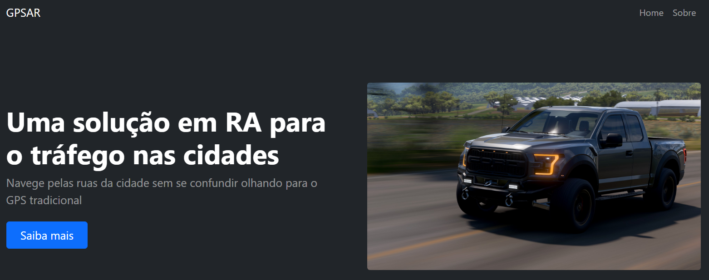

<h1 align="center">INH-GPSAR-Web</h1>

    

### Tópicos
:small_blue_diamond: [Sprint](#sprint-bookmark_tabs)  
:small_blue_diamond: [Sobre](#sobre-book)  
:small_blue_diamond: [Progresso](#progresso-arrow_up)  
:small_blue_diamond: [Integrantes 3ECA INH](#integrantes-3eca-inh-handshake)  

## Sprint :bookmark_tabs:
Entregável da Sprint 3 de `Advanced Programming & Mobile Dev`, professor:

| [ João Carlos Lima](https://github.com/joaocarloslima) | 
| :---: 

## Sobre :book:

    A atividade consiste em criar uma plataforma web com uma breve descrição do projeto GPSAR do grupo INH, um App que utiliza o serviço de GPS do smartphone com implementação de recursos de realidae aumentada (AR). Implementamos o framework Bootstrap para adicionar novos métodos e layouts pré-definidos.

    
    
    
    
    
    

## Progresso :arrow_up:
- [X] Página Index
- [X] Descrição sobre o projeto
- [X] Descrição de Desenvolvimento
- [X] Página Sobre

## Integrantes 3ECA INH :handshake:
- Leonardo Cesar de Mendonça - 84689 **(3ECR)**
- Luigi Di Benedetto Maximo Torres - 86335
- Moises Isaias Lima Quiñelén - 86427
- João Rafael Galhardo Rui - 82114
- Gabriel Boragina Fazani - 84447
- Rafael Perez Masson - 84380

    

